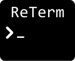
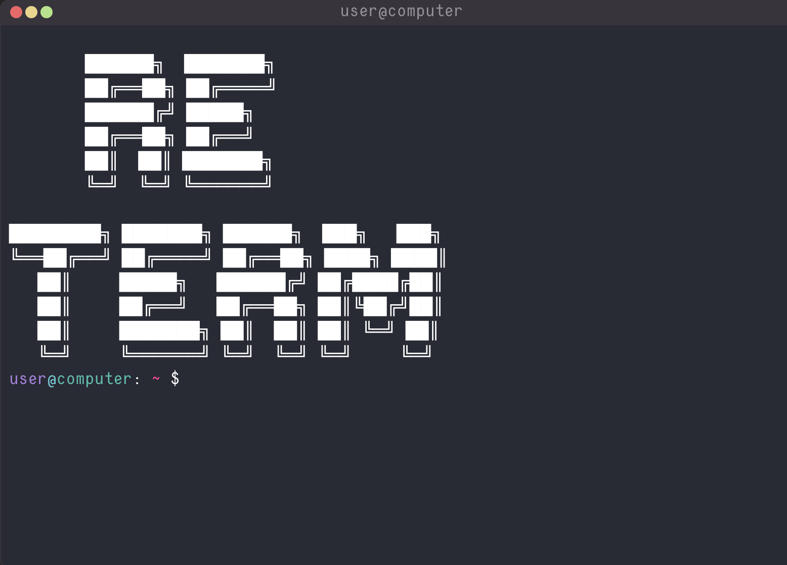

<h1 align="center">
  <a href="https://github.com/l2700l/reterm">
    
  </a>
</h1>

<div align="center">
  ReTerm
  <br />
  <a href="#about"><strong>Explore the screenshots »</strong></a>
  <br />
  <br />
  <a href="https://github.com/l2700l/reterm/issues/new?assignees=&labels=bug&template=01_BUG_REPORT.md&title=bug%3A+">Report a Bug</a>
  ·
  <a href="https://github.com/l2700l/reterm/issues/new?assignees=&labels=enhancement&template=02_FEATURE_REQUEST.md&title=feat%3A+">Request a Feature</a>
  .
  <a href="https://github.com/l2700l/reterm/issues/new?assignees=&labels=question&template=04_SUPPORT_QUESTION.md&title=support%3A+">Ask a Question</a>
</div>

<div align="center">
<br />

[](LICENSE)

[](https://github.com/l2700l/reterm/issues?q=is%3Aissue+is%3Aopen+label%3A%22help+wanted%22)
[](https://github.com/l2700l)

</div>

<details open="open">
<summary>Table of Contents</summary>

- [About](#about)
  - [Built With](#built-with)
- [Getting Started](#getting-started)
  - [Prerequisites](#prerequisites)
  - [Installation](#installation)
- [Usage](#usage)
- [Props](#props)
- [Roadmap](#roadmap)
- [Support](#support)
- [Project assistance](#project-assistance)
- [Contributing](#contributing)
- [Authors & contributors](#authors--contributors)
- [Security](#security)
- [License](#license)

</details>

---

## About

<table><tr><td>

Full featured terminal simulator.

There are many implementations of such terminals on the Internet, but, in my opinion, they are not functional enough. They represent the output of texts or elements on a predetermined command. 
This simulator also supports the launch of third-party applications, the configuration of which is set from the outside.

The goal of the project is to create a universal simulator with support for a virtual file system and running third-party applications

- Customizable commands,  user, name and prompt.
- Virtual file system.
- Support third-party applications.
- Command history using arrow up and down.
- Support for copy/paste.
- Customizing theme.

<details>
<summary>Screenshots</summary>
<br>


|                               Main                               |                                 Help command                                  |
|:----------------------------------------------------------------:|:-----------------------------------------------------------------------------:|
|  |  |

</details>

</td></tr></table>

### Built With

- [Typescript](https://www.typescriptlang.org/)
- [React](https://react.dev/)
- [react-device-detect](https://www.npmjs.com/package/react-device-detect)
- [SASS](https://sass-lang.com/)

## Getting Started

### Prerequisites

Your project must be a React app, version 17 or higher

### Installation

To install the library, write
```npm install reterm``` (or another package manager)
in your project.

This will also install the react-detect-device library.

## Usage

You can use both the simulator itself and the terminal, which is a GUI wrapper over the simulator.

```typescript jsx
import {Terminal} from 'reterm';


function App(props) {
  return (
    <Terminal
      startMessage={'Hi!'}
      prompt={'>>>'}
    />
  );
}
```
```typescript jsx
import {Simulator} from 'reterm';


function App(props) {
  const fs = {
    'file': 'someText',
    Directory: {
      'file1': '=)',
      'file2': 'UwU'
    }
  }
  return (
    <Simulator
      user={'reterm'}
      name={'prod'}
      fs={fs}
      borderRadius={{topLeft: '1rem', topRight: '16px', bottomLeft: '10%', bottomRight: '1vw'}}
    />
  );
}
```

## Props

| name         | description                                                                                                 | default       |
|--------------|-------------------------------------------------------------------------------------------------------------|---------------|
| user         | Username displayed on the command line. Value can be either a string or undefined                           | user          |
| name         | Computer name displayed on the command line. Value can be either a string or undefined                      | computer      |
| borderRadius | An object that defines the rounding of the border                                                           | 0,0,0,0       |
| startMessage | A welcome message to show at the start, before the prompt begins. Value can be either a string or undefined | undefined     |
| prompt       | Terminal prompt                                                                                             | $             |
| theme        | Custom theme                                                                                                | colors in css |
| fs           | Virtual file system - an object whose keys are only either strings or other similar objects                 | {}            |
| applications | an object whose keys are commands and whose values - are objects implementing the TermApp interface         | {}            |


## Roadmap

See the [open issues](https://github.com/l2700l/reterm/issues) for a list of proposed features (and known issues).

- [Top Feature Requests](https://github.com/l2700l/reterm/issues?q=label%3Aenhancement+is%3Aopen+sort%3Areactions-%2B1-desc) (Add your votes using the 👍 reaction)
- [Top Bugs](https://github.com/l2700l/reterm/issues?q=is%3Aissue+is%3Aopen+label%3Abug+sort%3Areactions-%2B1-desc) (Add your votes using the 👍 reaction)
- [Newest Bugs](https://github.com/l2700l/reterm/issues?q=is%3Aopen+is%3Aissue+label%3Abug)

## Support

Reach out to the maintainer at one of the following places:

- [GitHub issues](https://github.com/l2700l/reterm/issues/new?assignees=&labels=question&template=04_SUPPORT_QUESTION.md&title=support%3A+)
- Contact options listed on [my site](https://l2700l.github.io)

## Project assistance

If you want to say **thank you** or/and support active development of ReTerm:

- Add a [GitHub Star](https://github.com/l2700l/reterm) to the project.
- Tweet about the ReTerm.
- Write interesting articles about the project on [Dev.to](https://dev.to/), [Medium](https://medium.com/) or your personal blog.

Together, we can make ReTerm **better**!

## Contributing

First off, thanks for taking the time to contribute! Contributions are what make the open-source community such an amazing place to learn, inspire, and create. Any contributions you make will benefit everybody else and are **greatly appreciated**.


Please read [our contribution guidelines](docs/CONTRIBUTING.md), and thank you for being involved!

## Authors & contributors

The original setup of this repository is by [UwU](https://github.com/l2700l).

For a full list of all authors and contributors, see [the contributors page](https://github.com/l2700l/reterm/contributors).

## Security

ReTerm follows good practices of security, but 100% security cannot be assured.
ReTerm is provided **"as is"** without any **warranty**. Use at your own risk.

_For more information and to report security issues, please refer to our [security documentation](docs/SECURITY.md)._

## License

This project is licensed under the **MIT license**.

See [LICENSE](LICENSE) for more information.